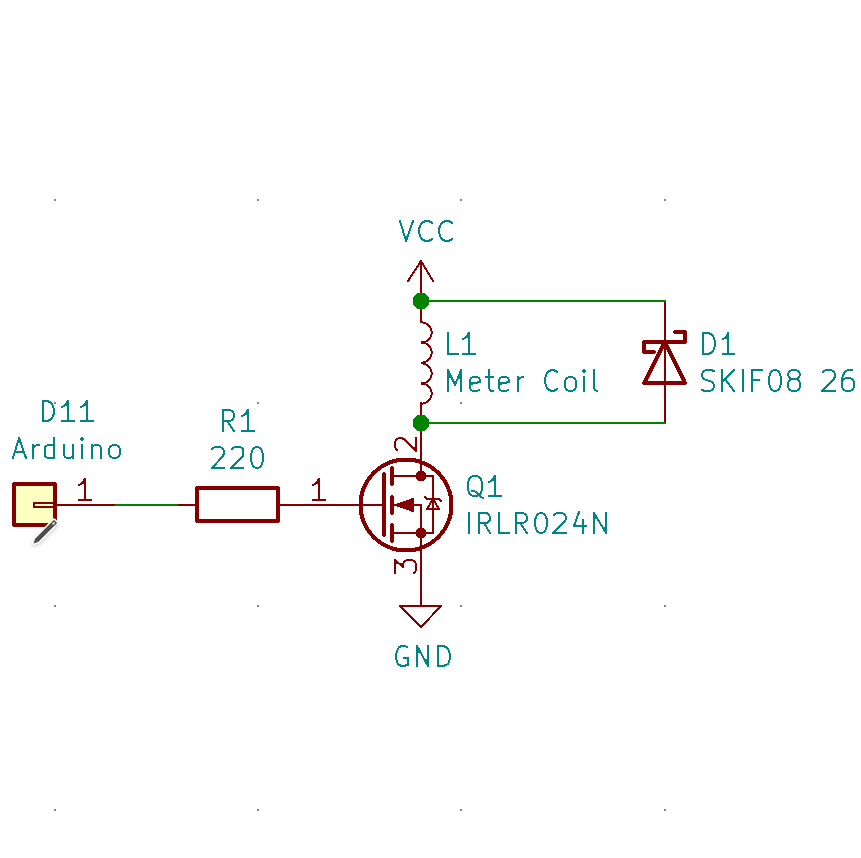

# Plant Meter
This is the GitHub repository for <TODO>.
It contains arduino code in the folder named "arduino_plantmeter"

## Wiring
The coil of the gauge is wired using a mosfet, diode and resistor to the arduino.
The types I used are in the schematic below, but other types might just work as well as long as you take a logic level mosfet that can switch at the speed and current required. As well as a diode that does the same to get rid of the coil spikes.

The moisture sensor is an Iduino ME110, like here: https://www.conrad.nl/p/iduino-me110-bodemvochtigheidssensor-1616242
It is wired to the A1 analog input of the arduino nano.

## Plates
The plates (and intermediate steps) are stored as gimp files, check https://www.gimp.org for more information about that editor, it's free!

## License
MIT License

Copyright (c) 2020 buildcomics

Permission is hereby granted, free of charge, to any person obtaining a copy
of this software and associated documentation files (the "Software"), to deal
in the Software without restriction, including without limitation the rights
to use, copy, modify, merge, publish, distribute, sublicense, and/or sell
copies of the Software, and to permit persons to whom the Software is
furnished to do so, subject to the following conditions:

The above copyright notice and this permission notice shall be included in all
copies or substantial portions of the Software.

THE SOFTWARE IS PROVIDED "AS IS", WITHOUT WARRANTY OF ANY KIND, EXPRESS OR
IMPLIED, INCLUDING BUT NOT LIMITED TO THE WARRANTIES OF MERCHANTABILITY,
FITNESS FOR A PARTICULAR PURPOSE AND NONINFRINGEMENT. IN NO EVENT SHALL THE
AUTHORS OR COPYRIGHT HOLDERS BE LIABLE FOR ANY CLAIM, DAMAGES OR OTHER
LIABILITY, WHETHER IN AN ACTION OF CONTRACT, TORT OR OTHERWISE, ARISING FROM,
OUT OF OR IN CONNECTION WITH THE SOFTWARE OR THE USE OR OTHER DEALINGS IN THE
SOFTWARE.
